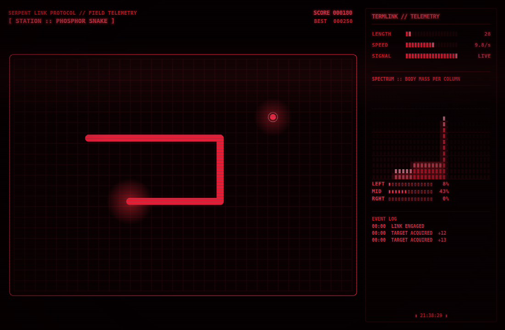

# Phosphor Snake

Snake on a red-phosphor CRT terminal. Native Linux, one Python file, GTK3 window, pycairo rendering.



The look is borrowed from two siblings: the **GPU Pulse** telemetry terminal (bezelled panels, `▰▱` segmented meters,
TERMLINK headers, scanlined graphs) and Soundscape's **pulse** visualizer (the segmented analyzer with phosphor
persistence and peak hold, the rolling CRT band, the vignette). Here the spectrum analyzer is driven by the game:
each bar is the snake's body mass in one column of the field, so it dances as you play. The snake is one solid
stroke that glides between cells at a constant speed (turns take effect at cell boundaries), eating flashes the
bezel, and the event log narrates the session.

## Run

```bash
git clone https://github.com/Sparaa/phosphor-snake && cd phosphor-snake
./phosphor_snake.py            # needs python3-gi (GTK3), python3-cairo, python3-pil — Ubuntu/Debian:
                               # sudo apt install python3-gi gir1.2-gtk-3.0 python3-cairo python3-pil
./install.sh                   # optional: ~/.local/bin/phosphor-snake + app-menu entry + icon, no sudo
```

| Key | Does |
|---|---|
| Arrows · WASD · HJKL | steer (two turns can be queued; reversals are ignored) |
| Space · P | engage / hold / resume; after SIGNAL LOST, re-engage |
| R | reset |
| F · F11 | fullscreen |
| Q · Esc | quit |

Flags: `--wrap` (no walls, the field wraps) · `--cells 32x22` (field size) · `--size 1100x720` (window size) ·
`--screenshot out.png` (render a staged frame, no window) · `--icon out.png` · `--bench` (3 s, prints the frame rate).

Speed ramps from about 7 to 17 steps a second as you eat. Score per target is 10 plus a fifth of your length. The
high score lives in `~/.local/share/phosphor-snake/highscore.json`.

## How it's drawn

GTK draw callbacks need the `gi` cairo bridge, which some distros ship separately (`python3-gi-cairo`). To depend on
nothing extra, every frame is rendered with plain pycairo into an image surface and blitted into a `Gtk.Image` as a
pixbuf. Rendering runs inside GTK's frame clock (`add_tick_callback`), so every update is followed by a paint; a plain
timer that does most of a frame's work at default priority starves GTK's redraw and leaves the window black. Each
glowing string is rasterised once and cached; the scanlines and vignette are one cached layer per window size. A
frame costs about 4 ms at 1100×720, and both X11 and Wayland run at the display's 60 Hz.

Tests (no GTK needed): `python3 -m unittest discover -s tests`.

## License

MIT.
